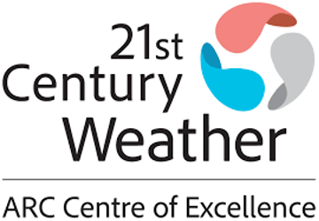
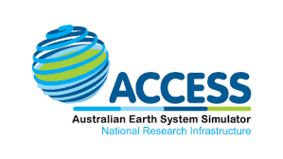
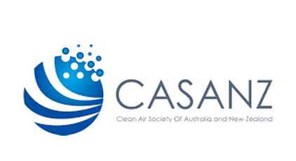
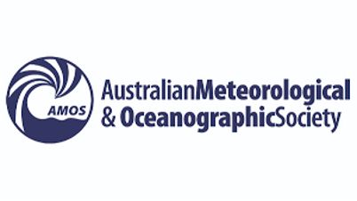
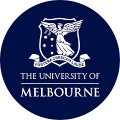
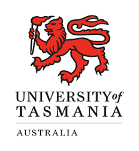
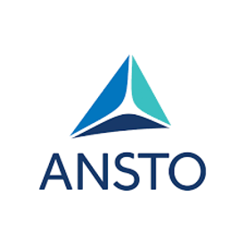

# CAPE-k Student Workshop

**Monday 3rd February** **–** **Thursday 6th February 2025**

Student-focused workshop held in Stanley, Tasmania, Australia with a field visit to the Kennaook/Cape Grim Baseline Air Pollution Station (KCGBAPS), the site of the CAPE-k field project.

## Sponsors
We thank the following sponsors for their support of this student workshop.
|                                       |                                       |
|:-------------------------------------:|:-------------------------------------:|
|  |  |
|  |  |

## Participating Organisations
We thank the following organisations for their sponsorship of participating students.

|                                       |                                       |
|:-------------------------------------:|:-------------------------------------:|
|  |  |
|  |  |
|  |  |
|  |  |

## Schedule

### Sunday February 2, 2025

| Time                | Topic                  | Presenter(s)                       |
| :---:               |    :----:              |    :---:                           |
| 06:00 PM - 07:00 PM | Meet @ Stanley Hotel Icebreaker   | Everyone!                          |

### Monday February 3, 2024

| Time                 | Topic                                  | Presenter(s)                       |
| :---:                |    :----:                              |    :---:                           |
| 08:30 AM - 09:30 AM  | [Intro to Cape-k, ARM, Welcome](https://docs.google.com/presentation/d/1X1lc7fCF4jDaD_nUZ8l6X7-4O0ZR3eB7/edit?usp=sharing&ouid=104304750518137712212&rtpof=true&sd=true)                  | Scott Collis     |
| 09:30 AM - 10:00 AM  | Coffee Break                           |                                    |
| 10:00 AM - 11:00 AM  | [Intro to Pythia + Binder](https://docs.google.com/presentation/d/1iZYW8Ch-pC5R0qn1eDfTA6YCqK1qugX4/edit?usp=sharing&ouid=104304750518137712212&rtpof=true&sd=true)            | Max Grover |
| 11:00 AM - 12:00 PM  | Intro to Cape Grim Meteorology and Cloud Physics     |  Steve Siems and Yi Huang         |
| 12:00 PM - 01:00 PM  | Lunch                                  |                                    |
| 01:00 PM - 01:45 PM  | Fundamentals in Aerosol Physics                          |    Alfred Wiedensohler                     |
| 01:45 PM - 02:30 PM  | Fundamentals in Aerosol Instrumentation                  |    Alfred Wiedensohler                     |
| 02:30 PM - 03:00 PM  | Coffee/Tea Break                       |                                    |
| 03:00 PM - 04:00 PM  | Hands on with some Aerosol Data at Cape Grim             | Alfred Wiedensohler                    |
| 04:00 PM - 05:00 PM  | [Elevator Pitch Intros](https://docs.google.com/presentation/d/1PisperAcY0L8hQgbDIkvMu3SHYPtXrYwaGOuE2otugo/edit?usp=sharing)                     | Everyone!          |
| 05:00 PM - 07:00 PM  | Return to hotel and prepare for dinner              |           |
| 07:00 PM - ?  | Dinner at Hursey Seafoods              |           |

### Tuesday February 4, 2025

Field Day Tour! Meet at your respective hotel/site to be transported to the KCG field site.

### Wednesday February 5, 2025

| Time                 | Topic                                  | Presenter(s)                       |
| :---:                |    :----:                              |    :---:                           |
| 08:30 AM - 09:30 AM  | Forming your Science Questions + Hypotheses        | TBD                         |
| 09:30 AM - 10:00 AM  | Coffee Break                           |                                    |
| 10:00 AM - 11:15 AM  | [Exploratory Data Analysis](notebooks/pandas/exploratory-analysis-with-pandas.ipynb)     | Max Grover + Scott Collis        |
| 11:15 AM - 12:00 PM  | Initial Project Updates  | Everyone                      |
| 12:00 PM - 01:00 PM  | Lunch          |                         |
| 01:00 PM - 05:00 PM  | Group Work!    |                                    |

### Thursday February 6, 2025

| Time                 | Topic                                  | Presenter(s)                       |
| :---:                |    :----:                              |    :---:                           |
| 08:30 AM - 09:30 AM  | Office Hours - Any Issues?        | Max Grover + Scott Collis                         |
| 09:30 AM - 10:00 AM  | Coffee/Tea Break                  |                                    |
| 10:00 AM - 01:00 PM  | Group Project Work Time     | Everyone        |
| 01:00 PM - 02:00 PM  | Lunch          |                          |
| 02:00 PM - 04:00 PM  | Group Project Presentation Prep |  Everyone                |                        |
| 04:00 PM - 05:00 PM  | Workshop Recap |  Everyone                |                        |
| 05:00 PM - 07:00 PM  | Return to hotel and prepare for dinner              |           |
| 07:00 PM - ?  | Stanley Hotel Bistro              |           |

### Friday February 7, 2025

Travel Home!

## Instructors and Facilitators

Please list your instructors and mentors below!

| Instructor | Affiliation | Links |
| :------- | ------- |:------- |
| Clare Murphy (Paton-Walsh) | The University of Wollongong | [Faculty Page](https://scholars.uow.edu.au/clare-murphy) |
| Scott Collis | Argonne National Laboratory | [Staff Page](https://www.anl.gov/profile/scott-m-collis) |
| Max Grover | Argonne National Laboratory | [Staff Page](https://www.anl.gov/profile/maxwell-grover) |
| Branka Miljevic | Queensland University of Technology | [Faculty Page](https://www.neiu.edu/faculty/joseph-hibdon) |
| Robyn Schofield | The University of Melbourne | [Faculty Page](https://findanexpert.unimelb.edu.au/profile/433184-robyn-schofield) |
| Ali Wiedensohler |  Leibniz Institute for. Tropospheric Research | [Faculty Page](https://www.tropos.de/en/institute/about-us/employees/alfred-wiedensohler) |
| Yi Huang | The University of Melbourne | [Faculty Page](https://findanexpert.unimelb.edu.au/profile/844217-yi-huang) |
| Steven Siems | Monash University | [Faculty Page](https://research.monash.edu/en/persons/steven-siems) |
| Andrew Ault | The University of Michigan | [Faculty Page](https://lsa.umich.edu/chem/people/faculty/aulta.html) |
| Kerri Pratt| The University of Michigan | [Faculty Page](https://lsa.umich.edu/chem/people/faculty/prattka.html) |
| Joanna Turner| The University of Southern Queensland | [Faculty Page](https://staffprofile.unisq.edu.au/profile/joanna-turner) |
| Ruhi Humphries| The Commonwealth Scientific and Industrial Research Organisation | [Staff Page](https://people.csiro.au/H/R/Ruhi-Humphries) |
| Melita Keywood| The Commonwealth Scientific and Industrial Research Organisation | [Staff Page](https://people.csiro.au/k/m/melita-keywood) |
| Stephen Wilson| The University of Wollongong | [Faculty Page](https://scholars.uow.edu.au/stephen-wilson) |
| Paul Krummel| The Commonwealth Scientific and Industrial Research Organisation | [Staff Page](https://people.csiro.au/k/p/paul-krummel) |
| Scott Chambers| Australia's Nuclear Science and Technology Organisation | [Staff Page](https://www.ansto.gov.au/people/dr-scott-chambers) |
| Sally Taylor| The Commonwealth Scientific and Industrial Research Organisation | [Staff Page](https://people.csiro.au/t/s/sally-taylor) |
